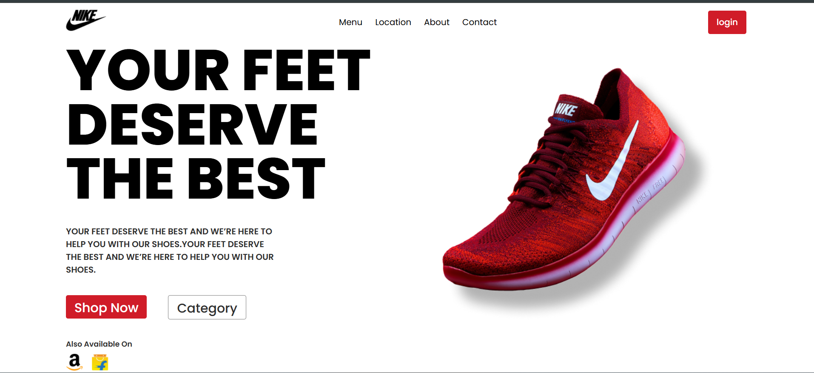

# Brand Page 👟

A simple React-based landing page for showcasing shoe brands and shopping options.  
This project is built with **React + Vite**.

## 🚀 Features
- Hero section with heading and tagline.
- Buttons for quick actions (Shop Now, Category).
- Brand icons (Amazon, Flipkart) for availability.
- Responsive layout with basic styling.

## 🛠️ Installation & Setup

1. Clone the repository:
   ```bash
   git clone https://github.com/your-username/brand-page.git
   cd brand-page
2. Install dependencies:
   npm install
3. Run Development Server:
   npm run dev

## 📸 Preview
   

## 📌 Tech Stack

React (frontend library)
Vite (build tool)
CSS (styling)
